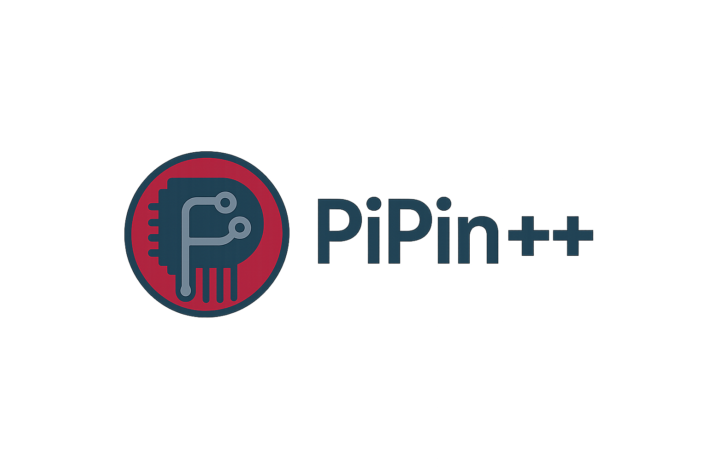

<div align="center">
  
  
  # PiPin++
  
  **A modern C++ GPIO library for Raspberry Pi**  
  *Clean API, low-level control, and room to grow.*
</div>

[](https://github.com/Barbatos6669/PiPinPP/actions/workflows/ci.yml)
[](https://github.com/Barbatos6669/PiPinPP/security/code-scanning)
[](https://www.codefactor.io/repository/github/Barbatos6669/PiPinPP)
[](https://opensource.org/licenses/MIT)

[](https://github.com/Barbatos6669/PiPinPP/releases/tag/v0.3.13)
[](https://www.raspberrypi.org/)
[](https://en.cppreference.com/w/cpp/17)
[](https://git.kernel.org/pub/scm/libs/libgpiod/libgpiod.git)
[](https://github.com/Barbatos6669/PiPinPP)

🚀 **[Getting Started](docs/GETTING_STARTED.md)** | 📚 **[Tutorials](docs/tutorials/)** | 🐛 **[Troubleshooting](docs/TROUBLESHOOTING.md)** | 📖 **[API Reference](docs/API_REFERENCE.md)** | 📌 **[Pin Numbering](docs/PIN_NUMBERING.md)**

---

> **⚡ Quick Install:** `curl -sSL https://raw.githubusercontent.com/Barbatos6669/PiPinPP/v0.3.13/install.sh | sudo bash`

---

## Project Vision

**PiPin++** aims to make Raspberry Pi GPIO control easy and familiar for makers, especially those coming from Arduino. Our goal is a modern, lightweight, and extensible C++ library that feels instantly comfortable for Arduino users—removing the hassle of adapting to Pi-specific APIs.

## Why?

- **Arduino makers often struggle to migrate projects to Raspberry Pi**, facing steep learning curves and inconsistent libraries.
- **We want PiPin++ to bridge that gap** with a clean, intuitive API and modern C++ features.

## Who's it for?

- Arduino users wanting to try Raspberry Pi projects
- Makers, hackers, students, educators
- Anyone needing simple, reliable GPIO control in C++

---

## Quick Start Example

**Blink an LED in 10 lines of code:**

```cpp
#include <ArduinoCompat.hpp>

int main() {
    pinMode(17, OUTPUT);              // Set GPIO 17 as output
    
    while (true) {
        digitalWrite(17, HIGH);       // Turn LED on
        delay(1000);                  // Wait 1 second
        digitalWrite(17, LOW);        // Turn LED off
        delay(1000);                  // Wait 1 second
    }
}
```

**Compile and run:**
```bash
g++ blink.cpp $(pkg-config --cflags --libs pipinpp) -o blink
sudo ./blink
```

That's it! If you know Arduino, you already know PiPin++. 🚀

---

## 📚 New to GPIO? Start Here!

**Complete beginner?** We've got you covered:

1. 🚀 **[Getting Started Guide](docs/GETTING_STARTED.md)** - Your first LED in 10 minutes
2. 📚 **[Tutorials](docs/tutorials/)** - Step-by-step projects (Traffic Light, Buttons, PWM)
3. 🐛 **[Troubleshooting](docs/TROUBLESHOOTING.md)** - Fix common issues
4. 📖 **[API Reference](docs/API_REFERENCE.md)** - Complete function documentation

**Coming from Arduino?** Check out:
- [Arduino Migration Example](examples/arduino_migration/) - Side-by-side comparison
- [Arduino Style Example](examples/arduino_style/) - Familiar `setup()` and `loop()`

---

## Features

**v0.3.13 RELEASED!** 🎉 Hardware PWM support for jitter-free servo control!

### Core GPIO (v0.1.0-v0.2.0)
- ✅ **Digital I/O**: Arduino-style pin control (`pinMode`, `digitalWrite`, `digitalRead`)
- ✅ **Pin abstraction**: Object-oriented pin management with RAII
- ✅ **Pull resistors**: Built-in `INPUT_PULLUP` and `INPUT_PULLDOWN` support
- ✅ **Arduino API**: Easy transition from Arduino sketches

### Advanced Features (v0.3.0-v0.3.12)
- ✅ **Timing functions**: `millis()`, `micros()`, `delay()`, `delayMicroseconds()` for precise timing
- ✅ **Interrupts**: Edge detection with callbacks (`attachInterrupt`, `detachInterrupt`)
- ✅ **Software PWM**: Thread-based PWM with `analogWrite()` (LED dimming, ~10-30% CPU per pin)
- ✅ **Hardware PWM**: Jitter-free PWM via `/sys/class/pwm` for servo control (GPIO12/13/18/19, zero CPU usage) (v0.3.13)
- ✅ **Pin queries**: Check pin state with `isOutput()`, `isInput()`, `getMode()`, `digitalToggle()`
- ✅ **Custom exceptions**: Type-safe error handling (`InvalidPinError`, `GpioAccessError`)
- ✅ **Math functions**: Arduino-inspired math functions (`sq()`, `constrain()`, `map()`, trigonometry constants)
- ✅ **Advanced I/O**: `pulseIn()`, `shiftOut()`, `shiftIn()`, `tone()`, `noTone()` (v0.3.6)
- ✅ **I2C/Wire**: Full Arduino Wire library compatibility for I2C communication (v0.3.6)
- ✅ **SPI**: Hardware SPI master with full Arduino compatibility (v0.3.7)
- ✅ **Serial/UART**: Arduino Serial API for communication with Arduino boards and sensors (v0.3.12)

### Quality & Testing (v0.3.0+)
- ✅ **GoogleTest framework**: 175 comprehensive automated tests
- ✅ **GitHub Actions CI/CD**: Multi-platform builds, automated testing, CodeQL security analysis
- ✅ **Modern CMake**: find_package() support, shared/static library options, pkg-config compatibility
- ✅ **20 Examples with Full Documentation**: Every example includes comprehensive README with wiring diagrams, troubleshooting, and extension ideas
- ✅ **Clean project structure**: Organized documentation, no root clutter

**v0.3.13 is production-ready with full Arduino API compatibility!**

### Longer-Term Goals (v0.4.0+)
- [ ] **Multi-platform support**: Orange Pi and other ARM SBCs
- [ ] **Advanced features**: Analog input, GPIO monitoring tools
- [ ] **Development tools**: VS Code extensions and debugging utilities

---

## Installation

### 🚀 One-Line Install (Recommended)

```bash
curl -sSL https://raw.githubusercontent.com/Barbatos6669/PiPinPP/v0.3.13/install.sh | sudo bash
```

This installs all dependencies, builds PiPinPP v0.3.13, and configures GPIO permissions automatically.

**Trust but verify?** Review the script first:
```bash
wget https://raw.githubusercontent.com/Barbatos6669/PiPinPP/v0.3.13/install.sh
less install.sh
sudo bash install.sh
```

### Manual Installation

```bash
# 1. Install dependencies
sudo apt-get update
sudo apt-get install build-essential cmake pkg-config git libgpiod-dev

# 2. Build and install
git clone https://github.com/Barbatos6669/PiPinPP.git
cd PiPinPP
git checkout v0.3.12
./build.sh
cd build
sudo make install
sudo ldconfig

# 3. Configure permissions
sudo usermod -a -G gpio $USER
# Log out and back in for this to take effect
```

**Verify installation:**
```bash
pkg-config --modversion pipinpp  # Should show: 0.3.7
```

📖 **For detailed installation options and troubleshooting, see [INSTALL.md](docs/INSTALL.md)**

### Using in Your Projects

**With pkg-config:**
```bash
g++ main.cpp $(pkg-config --cflags --libs pipinpp) -o main
```

**With CMake:**
```cmake
find_package(PiPinPP REQUIRED)
target_link_libraries(your_app PiPinPP::pipinpp)
```

---

## Contributing

**We're just getting started and welcome your ideas, feedback, and contributions!**

📋 **Check our [ROADMAP.md](docs/planning/ROADMAP.md) to see what we're working on next**

## 💬 Community & Support

**Join our Discord community for real-time support and discussions:**
- 🚀 **Quick help** with setup, coding issues, and troubleshooting  
- 💡 **Feature discussions** and Arduino migration questions
- 🔧 **Hardware projects** and GPIO usage examples
- 📢 **Development updates** and release announcements

> **[Join PiPin++ Discord Server](https://discord.gg/wXeZP8Ev)**

For formal bug reports and feature requests, please use GitHub Issues.

## 🤝 Contributing

- If you're an Arduino user, tell us which features or API patterns you'd love to see.
- Open an issue for suggestions, questions, or bug reports.
- Pull requests and documentation help are always welcome!
- Look for `good first issue` labels for beginner-friendly tasks.

See [CONTRIBUTING.md](.github/CONTRIBUTING.md) for detailed contribution guidelines.

---

## License

MIT

---

**PiPin++**: Making Raspberry Pi feel like home for Arduino makers.
